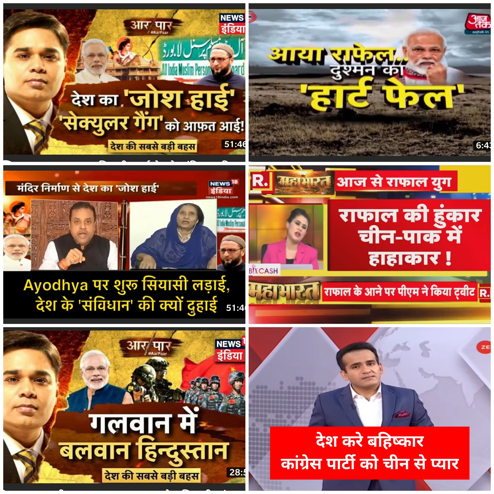
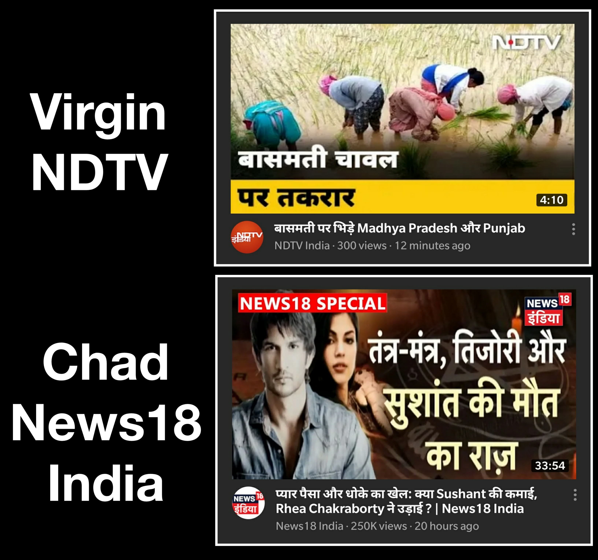

Before you call me anti-human in your tweets & Instagram stories -- read what I have to say. 

First of all, the title rhymes and we all know, whatever rhymes -- is the truth. 
For example, 

Now coming to my second logic, it sounds sensational. I mean c’mon guys we all love juicy, scandalous and HOT news. 
Be honest which of the two news channels will you watch?

My last point is 
-- WE ALL HATE people of Nepal, Pakistan and China because they are Nepali, Pakistani and Chinese. 
And coronavirus will eliminate these terrorists. We all want that unless you are from the tukde-tukde gang. 

I think you are convinced by now. Thank you for reading.

In case you expected some actual-hard-proof and logic from my side and not the bullshit arguments which I had put forth, well, my answer to that is - I am just a meme page who is inspired by these news channels [who] bring in millions of Rupees home at the end of the day by the same bullshit. 

Journalism is tightening up the noose around the neck of humanity and we are watching it with an adrenaline rush. Bad govt can be voted out. Fake news can be debunked. 

But what do you do when the news gives you scapegoats, juicy drama and unbelievable stories that you can share on WhatsApp all day and night? 

[[warning]]
| Good reporting is not dead - your critical thinking is!

- By Ashutosh Dubey
> *Follow me on Twitter: [@ashutosh_c137](https://twitter.com/ashutosh_c137)*

Feel free to share: 

-------
# Connect with us via our Newsletter

Subscribe us for regular updates

<!-- Begin Mailchimp Signup Form -->
<link href="//cdn-images.mailchimp.com/embedcode/classic-10_7.css" rel="stylesheet" type="text/css">

<form action="https://allindiadankmemes.us10.list-manage.com/subscribe/post?u=6f493ca660d8fdacea8023c64&amp;id=564978785f" method="post" id="mc-embedded-subscribe-form" name="mc-embedded-subscribe-form" class="validate" target="_blank" novalidate>
    

	<h2>Subscribe</h2>

* indicates required

	<label for="mce-EMAIL">Email Address  *
</label>
	<input type="email" value="" name="EMAIL" class="required email" id="mce-EMAIL">

	

		

		

	
    <!-- real people should not fill this in and expect good things - do not remove this or risk form bot signups-->
    
<input type="text" name="b_6f493ca660d8fdacea8023c64_564978785f" tabindex="-1" value="">

    
<input type="submit" value="Subscribe" name="subscribe" id="mc-embedded-subscribe" class="button">

    

</form>

<!--End mc_embed_signup-->

[[info]]
| We hate spam as much as you do. We promise to never share any email ID with anyone. Ever.