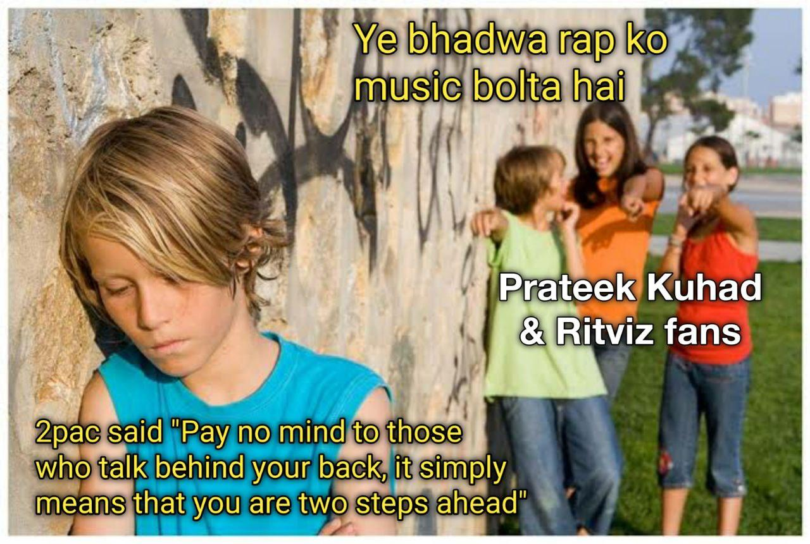

## Confessions of a proud Prateek Kuhad stan!

I adore Prateek Kuhad so much. And before you ask, yes, I am a sapiosexual. I have his posters hanging in my bedroom. I play Kuhad when I am in a state of eternal bliss after getting a chicken dinner in PUBG mobile. I play Kuhad when I am feeling blue because I got a zero in my history test. And I will play Kuhad during sex once I become an adult and get married. It's not just his voice that pleases my soul but his music, too... that makes my bowel movement so smooth. 

I cringe on people when they can't understand how "cold/mess" is a poetic genius. They talk about some Tupac Shakur being a lyrical genius. I read that he was some gangster who rapped about social issues. I mean can't they even see it's an oxymoron LMAO.  

They tell me I just listen to Kuhad to impress girls. As if Prateek Kuhad's music is not "manly enough" for 15-year-old boys, haan? Now you will also say that his music is not versatile. He just makes the same song again and again and sells it in new packaging. I mean why stop there? Just go ahead claim that he and Billie Eilish are the same people just because they both whisper words and not actually sing them. Huh! Kids.

I pity people who do not understand Kuhad's art because they will never know the power of pure love and music. I wish I can show them things which can only be felt. I think it's too late for them. Anyway, me and the boys gonna listen to Kuhad on discord now. Goodbye. And rap is not music.

-------
# Connect with us via our Newsletter

Subscribe us for regular updates

<!-- Begin Mailchimp Signup Form -->
<link href="//cdn-images.mailchimp.com/embedcode/classic-10_7.css" rel="stylesheet" type="text/css">

<form action="https://allindiadankmemes.us10.list-manage.com/subscribe/post?u=6f493ca660d8fdacea8023c64&amp;id=564978785f" method="post" id="mc-embedded-subscribe-form" name="mc-embedded-subscribe-form" class="validate" target="_blank" novalidate>
    

	<h2>Subscribe</h2>

* indicates required

	<label for="mce-EMAIL">Email Address  *
</label>
	<input type="email" value="" name="EMAIL" class="required email" id="mce-EMAIL">

	

		

		

	
    <!-- real people should not fill this in and expect good things - do not remove this or risk form bot signups-->
    
<input type="text" name="b_6f493ca660d8fdacea8023c64_564978785f" tabindex="-1" value="">

    
<input type="submit" value="Subscribe" name="subscribe" id="mc-embedded-subscribe" class="button">

    

</form>

<!--End mc_embed_signup-->

[[info]]
| We hate spam as much as you do. We promise to never share any email ID with anyone. Ever.