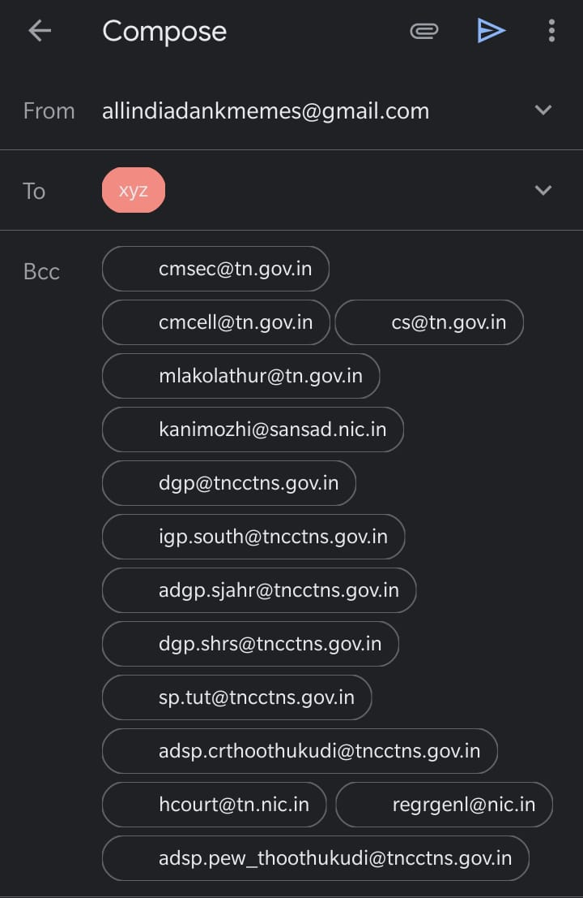
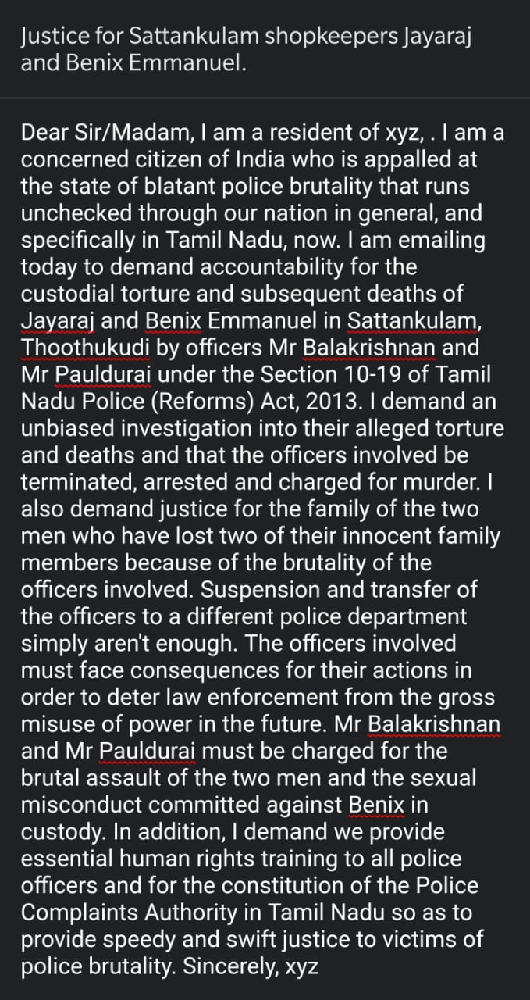

## Justice for Sattankulam shopkeepers Jayaraj and Benix Emmanuel

Police brutality should not exist in a civilised society. If you are not aware -- this is what happened in Tamil Nadu:

<iframe src="https://www.youtube.com/embed/xgC3UpERJFk" frameborder="0" allow="accelerometer; autoplay; encrypted-media; gyroscope; picture-in-picture" allowfullscreen></iframe>

What we can do from our side is request the authorities to take whatever action needed against the people accountable for such horrible act and try to get the justice for the family who lost their father/husband & son. 

We are providing you with an already typed email. You just have to fill your name and city and it will take you to your email app/browser with all the required details already filled. 

### You just need to follow below steps:

* Fill your details into the form below

* Click on the button to trigger the email, which should open in your default mail app.

* From there (your email app), just click on send

Fill in your details and click on button

    <input type="email" placeholder="Enter email ID" id="useremailAddress">
    <input type="text" placeholder="your full name" id="userName">
    <input type="text" placeholder="your city name" id="userCity">
    <input type="text" placeholder="your state" id="userState">
    

Please note:
[[info]]
| Once you send the email, you will recieve a copy as well since in the TO field, it will be your email ID
[[info]]
| The BCC part of the email has all high level authorities email IDs 

### Below is the preview of the email draft:

To and BCC email fields: 

The subject and the body:

**Thanks for your time and effort. Peace ✌**